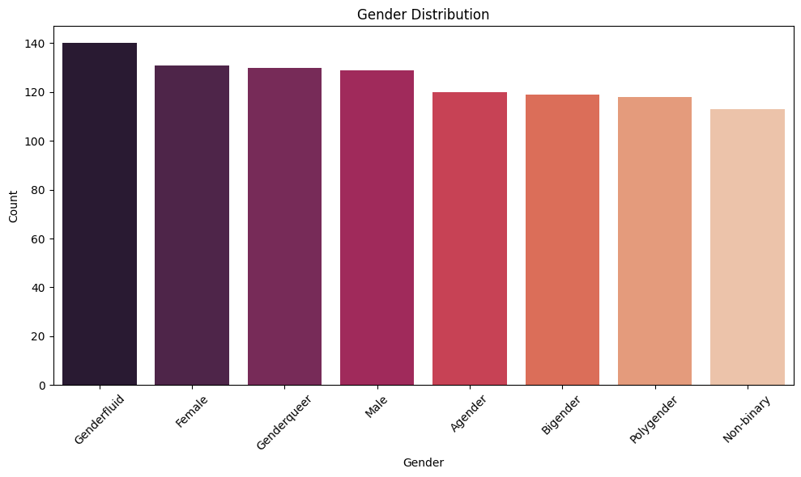
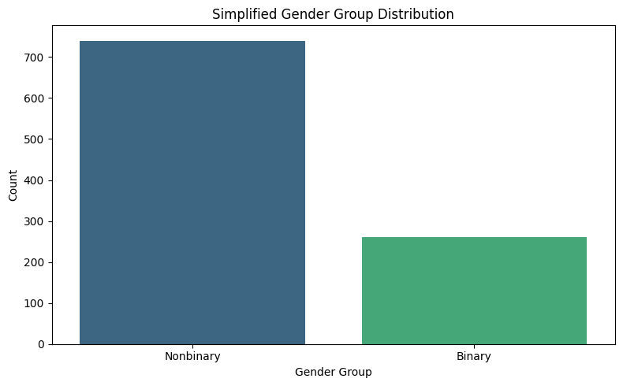

# Section 1 – Database Configuration & Python ETL #

This section provisions a PostgreSQL database using Docker and demonstrates a complete ETL (Extract, Transform, Load) workflow using Python. It includes data ingestion from an Excel file, enrichment through transformations, and loading into a PostgreSQL container.

## Files ##

- `01_docker-compose.yml` – Configures and launches a PostgreSQL container for local development
- `02_requirements.txt` – Lists all Python dependencies for this ETL pipeline
- `03_section1_etl_notebook.ipynb` – Main deliverable; contains code, commentary, visualizations, and transformation steps
- `04_etl_pipeline.py` – Optional standalone script version of the ETL logic (can be run without Jupyter)
- `output_GenderDist.png` – Visualization of original gender labels
- `output_GenderDist_Simp.png` – Visualization of grouped gender categories
- `README.md` – This file

## Setup Instructions ##

### 1. Start the PostgreSQL Database ###
Run the following command from the `section1_ETL` directory:

```bash
docker-compose up -d
```

This will start a PostgreSQL instance locally at:
- Host: `localhost`
- Port: `5432`
- Username: `nina`
- Password: `password123`
- Database: `challenge_db`

> **Note:** These credentials are for local development only. In production, secrets should be managed via environment variables or secure vaults.

### 2. Install Python Dependencies ###

Use the included requirements file to install dependencies:

```bash
pip install -r 02_requirements.txt
```

### 3. Run the Notebook ###
Open `03_section1_etl_notebook.ipynb` in Jupyter or VS Code and follow each cell to:
- Load the Excel file
- Inspect and clean the data
- Apply transformations (e.g., email domain classification, gender grouping)
- Visualize results
- Load the final dataset into the PostgreSQL table: `chemberta_dataset`

### 4. Optional: Run ETL as a Script ###

If preferred, you can run the ETL outside the notebook:

```bash
python 04_etl_pipeline.py
```

## Key Transformations ##
- Standardized column names
- Grouped gender identities into three simplified categories: `Binary`, `Nonbinary`, `Other`
- Extracted email domains and classified them as `Personal`, `Academic`, or `Corporate`
- Optional enrichments like name length and domain frequency

## Visualizations ## 

### Original Gender Distribution ###


### Simplified Gender Group Distribution ###


## Result ##
A clean, enriched dataset loaded into PostgreSQL and ready for downstream ML modeling, analytics, or API integration.

