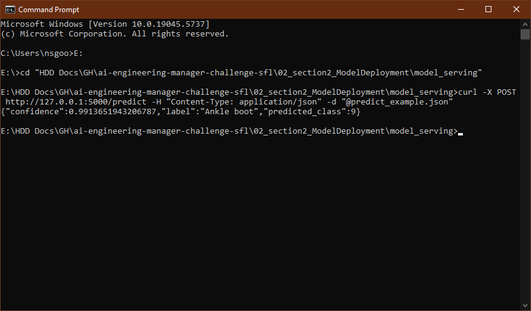

# Section 2 – ML Model Deployment #

This section demonstrates how to train a simple neural network model using the Fashion MNIST dataset and deploy it as a REST API using Flask and Docker.

## Files ##

- `model_training.py` – Trains a CNN on Fashion MNIST and saves the model as `fashion_mnist_model.h5`
- `model_training_notebook.ipynb` – Jupyter notebook with visualizations, training plots, and commentary
- `sample_fashion_mnist.png` – Visualization of sample training images
- `model_serving/` – Contains all files related to API deployment:
  - `app.py` – Flask app that loads the model and exposes a `/predict` endpoint
  - `requirements.txt` – Dependencies for serving
  - `Dockerfile` – Docker configuration to containerize the API
  - `fashion_mnist_model.h5` – Trained model used by the API
  - `predict_example.json` – Sample JSON input for the API
  - `sample_json.py` – Script to generate a test prediction payload

## Setup Instructions ##

### 1. Install Dependencies ###
```bash
pip install tensorflow flask numpy
```

### 2. Run the Flask App Locally ###
```bash
python model_serving/app.py
```

### 3. Train the Model ###
```bash
python model_training.py
```
This creates `fashion_mnist_model.h5`, which is needed by the Flask app.

### 4. Build Docker Image ###
From inside the `model_serving/` folder:
```bash
docker build -t fashion-api .
```

### 5. Run Docker Container ###
```bash
docker run -p 5000:5000 fashion-api
```

The API will be available at `http://127.0.0.1:5000/predict`

### 6. Send a Test Prediction Request ###
From a second terminal:
```bash
curl -X POST http://127.0.0.1:5000/predict -H "Content-Type: application/json" -d "@model_serving/predict_example.json"
```

You will receive a JSON response with the predicted class, label, and confidence.

---

## Notes ##
> **Disclaimer:** Fashion MNIST is used in this section as a stand-in for ChemBERTa to demonstrate the model deployment pipeline. While the model architecture and data differ from BPC’s intended use case, the underlying structure—training a model, saving it, and exposing it via an API—remains applicable. In a production scenario, this pipeline could be adapted to serve ChemBERTa predictions by adjusting the input/output formats and computational environment accordingly.

---

## API Running in Docker – Sample Output ##
Below is a sample prediction response served from within the Docker container:


