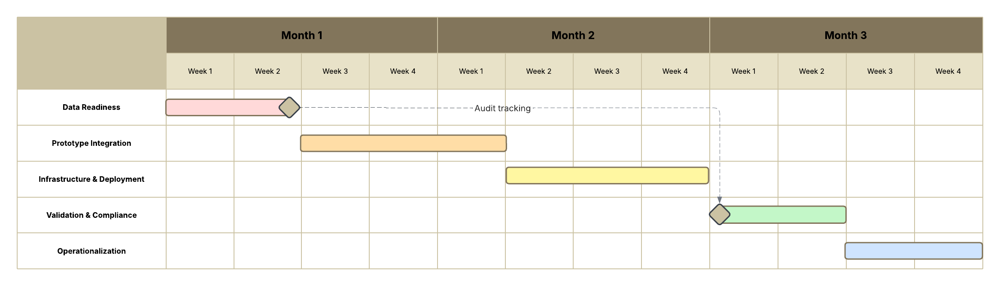

# ChemBERTa Implementation Work Plan for BPC # 

## 1. Executive Summary ##
BPC seeks to improve how it represents molecules for downstream property prediction by adopting ChemBERTa — a machine learning model that generates chemical “fingerprints” from SMILES strings. This work plan outlines a modular, phased approach to integrating ChemBERTa into BPC’s existing infrastructure. The plan focuses on enhancing chemical screening accuracy while meeting regulatory standards, supporting future scalability, and enabling rapid internal experimentation.

## 2. Current State Analysis ##
Note: This section reflects the implementation team's best-practice assumptions based on typical pharmaceutical infrastructure and the prompt's statement that BPC has a "competent IT/cloud team but no prior experience with AI/ML workloads."

BPC has a capable IT and cloud infrastructure team but lacks hands-on experience with AI/ML systems. There is no prior deployment of transformer models, though standard cheminformatics tools (e.g., RDKit, KNIME) are in use. The organization has cloud resources provisioned (e.g., AWS/GCP) and data repositories available for molecular property data. However, no pipeline exists for self-supervised model training, fine-tuning, or scalable inference.

## 3. Project Objectives ##
*  Deploy ChemBERTa to generate chemical embeddings for property prediction
*  Integrate the model into existing chemical screening workflows
*  Establish MLOps practices for retraining, monitoring, and model versioning
*  Ensure compliance with pharma-specific regulations for model transparency and traceability

## 4. Technical Architecture Overview ## 

### Pipeline components: ###

*  Input Layer: SMILES strings are ingested from laboratory information management systems (LIMS), electronic lab notebooks (ELNs), or internal compound databases. Ingestion can be batch-based (CSV uploads) or API-driven (real-time).
*  Preprocessing: Molecules are validated for SMILES syntax, canonicalized using RDKit, and tokenized into substructures suitable for ChemBERTa. Preprocessing also includes deduplication, salt stripping, and charge normalization to ensure consistency across training and inference.
*  Embedding: The ChemBERTa model converts preprocessed SMILES into high-dimensional vector embeddings using a transformer-based architecture. Embeddings are computed using a fine-tuned model and cached for reuse. This component may run on GPU-enabled infrastructure for performance.
*  Prediction Module: The embeddings are fed into downstream models (e.g., fully connected neural networks, decision trees, or logistic regressors) to predict molecular properties such as solubility, toxicity, bioavailability, or target binding affinity. This module is modular and supports multiple property-specific heads.
*  MLOps Layer: Model deployment is managed through containerized APIs (e.g., FastAPI or Flask), tracked via MLflow or DVC, and version-controlled for auditability. CI/CD pipelines trigger deployments, while model drift is monitored using metrics dashboards (e.g., Prometheus, Grafana). Access control, encryption, and audit logging are included to meet pharma compliance needs.

## 5. Phased Implementation Plan ##

### Phase 1 – Data Readiness (2 weeks) ###

*  Audit existing SMILES datasets and labeling consistency
*  Annotate or curate benchmark datasets for evaluation
*  Define metadata standards for reproducibility
*  Deliverables: data audit summary, benchmark-ready dataset, metadata schema

### Phase 2 – Prototype Integration (3 weeks) ###

*  Fine-tune pretrained ChemBERTa on a target molecular property task
*  Evaluate embedding quality with PCA/UMAP + benchmark metrics
*  Validate inference time and performance on sample workloads
*  Deliverables: fine-tuned ChemBERTa model, performance report, embedding visualizations

### Phase 3 – Infrastructure & Deployment (3 weeks) ###

*  Containerize ChemBERTa with APIs for internal access
*  Implement autoscaling inference service (e.g., FastAPI + Kubernetes)
*  Build secure storage for models, logs, and experiment metadata
*  Deliverables: Dockerized model API, secured model registry, internal API endpoint

### Phase 4 – Validation & Compliance (2 weeks) ###

*  Run audit trail simulations for model explainability and data lineage
*  Apply versioning strategy for reproducibility (e.g., DVC or MLflow)
*  Generate documentation for internal compliance and approval boards
*  Deliverables: audit trail report, versioned training configs, compliance documentation

### Phase 5 – Operationalization (2 weeks) 
*  Transition to monitored production deployment
*  Implement retraining triggers based on data or performance drift
*  Train internal teams on usage, reporting, and governance
*  Deliverables: retraining automation scripts, monitoring dashboard, user onboarding material

## 6. Team Roles and Skillsets ##

The team structure for this implementation was designed to cover the full lifecycle of an ML deployment project within a regulated pharmaceutical environment. We selected roles that span from model development and infrastructure to compliance oversight. A senior ML Engineer with ChemBERTa expertise anchors the modeling effort, supported by a Data Engineer for preprocessing and ingestion workflows. An MLOps Engineer ensures that the model can be deployed, monitored, and retrained in a scalable way. A Project Manager oversees delivery and coordination, while a part-time Compliance Lead ensures the project adheres to industry regulations without bloating staffing costs.

|Role                    |Level	     |Skills Required                                     |Quantity|
|------------------------|:---------:|:--------------------------------------------------:|-------:|
|ML Engineer (ChemBERTa) |Senior	 |NLP models, transformers, fine-tuning, PyTorch      |       1|
|Data Engineer           |Mid        |Data ingestion, pipeline design, cloud storage      |       1|
|MLOps Engineer          |Mid–Senior |Docker, CI/CD, model monitoring                     |       1|
|Project Manager         |Mid        |Agile delivery, stakeholder coordination            |       1|
|Compliance Lead         |Mid        |Pharma regulation, documentation, audit trail design| 0.5 FTE|

## 7. Cost Estimates ##

Our cost estimates reflect a realistic mid-tier outlook for a pilot-phase ML deployment in a pharmaceutical context. Personnel costs were projected using a fully loaded monthly rate of $15,000 per team member, which includes salary, benefits, and overhead. Cloud compute costs account for GPU use during training as well as inference-time deployment in a Kubernetes-based system. We included modest tooling costs for services like MLflow or hosted monitoring platforms, while allowing room for open-source implementations. These estimates are designed to scale up or down depending on BPC’s long-term infrastructure commitments.

|Resource                   |Estimated Monthly Cost|Notes                                          |
|---------------------------|:--------------------:|-----------------------------------------------|
|Cloud compute (GPU, dev)   |$2,500	               |Fine-tuning & prototype workloads              |
|Cloud compute (inference)  |$1,200     	       |Kubernetes autoscaling + storage               |
|Personnel (5 team members) |$75,000         	   |Assumes avg fully loaded cost of $15,000/month |
|Tools (MLflow, monitoring) |$500                  |May leverage open-source alternatives          |
|Total Monthly Estimate     |$79,200               |Includes a moderate assumption for FTE         |

## 8. Risks and Mitigation Strategies ##

This risk matrix was developed to reflect the most common challenges observed in real-world pharmaceutical AI deployments. Given that ChemBERTa is a relatively new model in the cheminformatics space, underperformance on internal datasets is a credible risk. We mitigate this through early benchmarking and phase-gated fine-tuning. Regulatory opacity is addressed by integrating interpretability frameworks and aligning documentation with compliance frameworks like Good Practice. We also acknowledge organizational friction (particularly where infrastructure or skill gaps exist) and plan for those with modular, container-based deployment and onboarding support.

|Risk                                     |Mitigation Strategy                                     |
|-----------------------------------------|--------------------------------------------------------|
|Model underperforms on internal datasets |Conduct early benchmarking and property-specific fine-tuning using curated internal datasets|
|Regulatory rejection due to opacity      |Leverage explainability tools (e.g., SHAP, attention maps) and document with GxP/FDA Part 11 in mind|
|Infrastructure mismatch                  |Use OCI-compliant containers and integrate with existing API gateways and security standards|
|Team lacks ChemBERTa familiarity         |Upskill via onboarding sessions, internal wiki, and support from external subject matter consultants|
|Model underperforms on internal datasets |Conduct property-specific fine-tuning and data curation |
|Regulatory rejection due to opacity      |Incorporate explainability tools (e.g., SHAP, attention maps)|
|Infrastructure mismatch                  |Build modular containerized APIs with internal standards|
|Team lacks ChemBERTa familiarity         |Upskill via onboarding sessions, internal wiki          |

## 9. Timeline and Deliverables ##

The proposed timeline is structured across five phases over a 12-week period, with each stage building upon the prior. Data Readiness and Prototype Integration are prioritized early to enable a strong technical foundation. Infrastructure work runs in parallel with model iteration to reduce idle time. Validation and compliance milestones are scheduled after internal benchmarks are met to ensure traceability, while the final phase focuses on transitioning the solution into monitored production. This timeline reflects typical cycle times for similar pilots and can be compressed or extended depending on available resources.

### Milestone Timeline ###

|Phase                              |Week(s)|Key Deliverables                                      |
|-----------------------------------|:-----:|------------------------------------------------------|
|Phase 1 – Data Readiness           |1–2    |Dataset audit, benchmark-ready dataset, metadata schema|
|Phase 2 – Prototype Integration    |3–5    |Fine-tuned ChemBERTa model, performance metrics, UMAP plots|
|Phase 3 – Infrastructure           |6–8    |Containerized model, internal test endpoint, registry storage|
|Phase 4 – Validation & Compliance  |9–10   |Audit trail documentation, versioned configs, compliance package|
|Phase 5 – Operationalization       |11–12  |Monitoring tools, retraining scripts, training material|

## 10. Summary and Next Steps ##
This work plan presents a modular, phased approach for implementing ChemBERTa as BPC’s foundation for modern chemical fingerprinting and molecular property prediction. The outlined architecture, infrastructure, and compliance strategies ensure the solution is not only technically sound but also aligned with pharmaceutical regulatory standards.

Upon approval, we recommend scheduling a project kickoff meeting to align stakeholders, confirm infrastructure readiness, and initiate Phase 1 (data audit and dataset preparation). is designed to help BPC realize molecular prediction capabilities with enterprise-grade scalability and regulatory compliance. Upon approval, we recommend scheduling a kickoff meeting to align stakeholders and begin Phase 1 (data audit + infrastructure prep).
