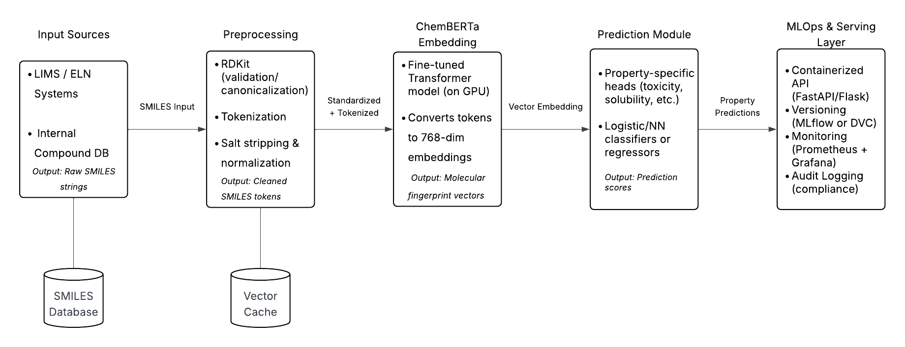
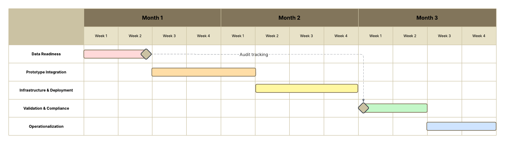

# Section 3 – ChemBERTa Implementation Strategy #

This folder contains the full work plan document submitted as part of the AI Engineering Manager assessment.

## Files ##

- `ChemBERTa_Workplan.md` – Full technical and strategic implementation plan
- `chemberta_pipeline_diagram.png` – Architecture overview
- `chemberta_gantt_chart.png` – Phase-based project timeline

> This document proposes a phased implementation strategy for integrating ChemBERTa into BPC's infrastructure to enable chemical fingerprinting for molecular property prediction.

## Visualizations ##

### Technical Architecture Overview ### 

### Timeline and Deliverable Dependencies ###

